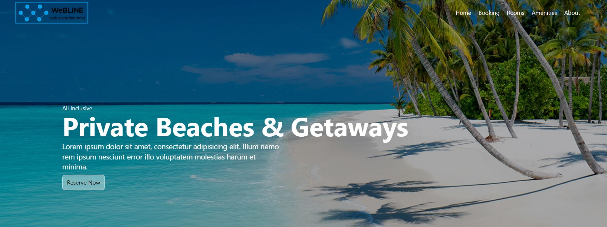

# A awesome Travel Agency App with React-Tailwindcss
#### Full Mobile Responsive App

### Go to Live Project: https://travel1-react-tailwined-app.netlify.app/

#### Add image with link in Readme Directory:

### What I use here:
* React
* Tailwindcss
* React-scroll
* React-icons

#### First Create React App by using command line:

    npx create-react-app ./

### For install Tailwind you have to follow 4 steps, such as...

#### Install Tailwind CSS by command line:

    npm install -D tailwindcss

#### Generate your tailwind.config.js file:

     npx tailwindcss init

#### Configure your template paths
#### Add the paths to all of your template files in your tailwind.config.js file:

    content: [
      "./src/**/*.{js,jsx,ts,tsx}",
    ],
  
 #### Add the Tailwind directives to your CSS:
    @tailwind base;
    @tailwind components;
    @tailwind utilities;
 
 ### Install & import React-Icon:
    npm i react-icons --save
    import { FaBars, FaTimes, } from 'react-icons/fa'
 
### Install & import React-scroll:
    npm install react-scroll
    import { Link } from 'react-scroll'
